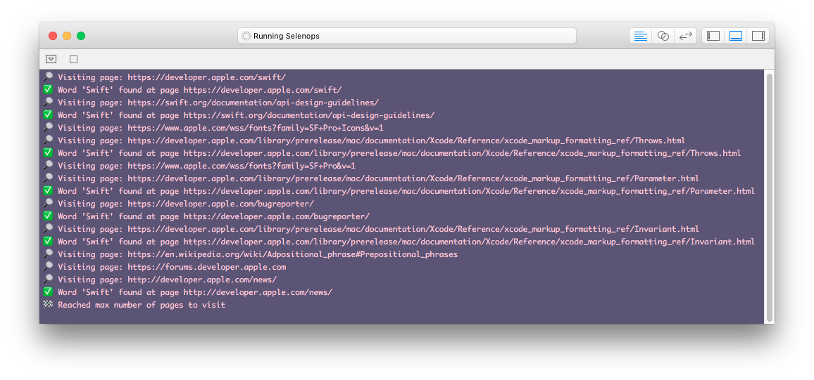

# Selenops 🕷
<p align="center">
    
</p>

Welcome to **Selenops**, a stupid simple Swift Web Crawler.

This repository contains three ways to use Selenops:

* A Swift Playground
* A Swift Script
* A 🏃[Marathon](https://github.com/johnsundell/marathon) Script

To know more about everything above, please refer to my blog [here](https://www.fivestars.blog/code/build-web-crawler-swift.html).

## Installation 🕸
[Download](https://github.com/zntfdr/Selenops/archive/master.zip) or clone the repo:

```
$ git clone git@github.com:zntfdr/Selenops.git
```

## How to Run Selenops 🕷
<p align="center">
    
</p>

* Swift Playground<br/>Just open the ``.playground`` package with Xcode.<br/><br/>
* Swift Script <br/>Make ``Script/Selenops.swift`` executable: ``$ chmod +x Script/Selenops.swift``<br/><br/>Run it: ``$ Script/Selenops.swift``.<br/><br/>
* 🏃[Marathon](https://github.com/johnsundell/marathon) Script<br/>Install the script: ``$ marathon install https://raw.githubusercontent.com/zntfdr/Selenops/master/Script/Selenops.swift``<br/><br/>Run it from anywhere: ``$ selenops``.

## Author 🕸
[Federico Zanetello](https://github.com/zntfdr) ([@zntfdr](https://twitter.com/zntfdr))
