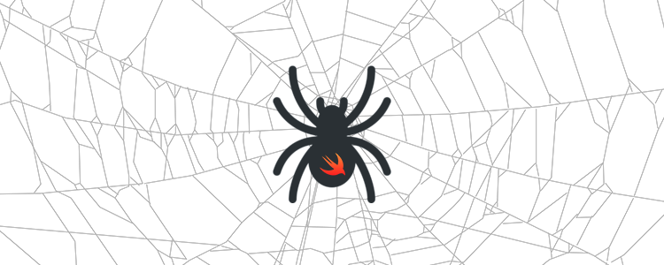
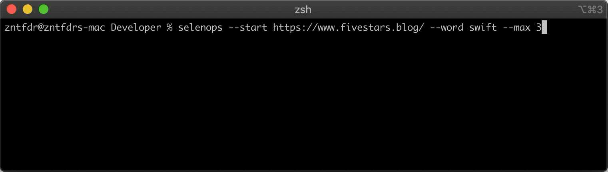

# Selenops
<p align="center">
    
    <br/>
    
    <a href="https://swift.org/package-manager">
        
    </a>
     
    <a href="https://twitter.com/zntfdr">
        
    </a>
</p>

Welcome to **Selenops**, a Swift Web Crawler.

## Usage

Create an object that conforms to `CrawlerDelegate`:


```swift
import Selenops

// Initialize crawler.
let crawler = Crawler(
  startURL: URL(string: "https://fivestars.blog/")!,
  maximumPagesToVisit: 10,
  wordToSearch: "Swift"
)

// Set delegate.
crawler.delegate = self // Needs to conform to CrawlerDelegate

// Start crawling!
crawler.start()
```

## Installation

Selenops is distributed via the [Swift Package Manager](https://swift.org/package-manager):  

- to use it into an app, follow [this tutorial](https://developer.apple.com/documentation/swift_packages/adding_package_dependencies_to_your_app) and use this repository URL: `https://github.com/zntfdr/Selenops.git`.

- to use it in a package, add it as a dependency in your `Package.swift`:
```swift
 let package = Package(
     ...
     dependencies: [
         .package(url: "https://github.com/zntfdr/Selenops.git", from: "1.0.0")
     ],
     targets: [
        .target(
            ...
            dependencies: ["Selenops"])
     ],
     ...
 )
```
  ...and then use `import Selenops` whenever necessary.

## Command line tool
<p align="center">
    

Selenops also comes with a command line tool that showcases its functionality.

To install it, clone the project and run make:

```shell
$ git clone https://github.com/zntfdr/Selenops.git
$ cd Selenops
$ make
```

## Credits

Selenops was built by [Federico Zanetello](https://twitter.com/zntfdr) as an [example of a Swift script][selenopsArticle].

## Contributions and Support

All users are welcome and encouraged to become active participants in the project continued development — by fixing any bug that they encounter, or by improving the documentation wherever it’s found to be lacking.

If you'd like to make a change, please [open a Pull Request](https://github.com/zntfdr/Selenops/pull/new), even if it just contains a draft of the changes you’re planning, or a test that reproduces an issue.

Thank you and please enjoy using **Selenops**!

[selenopsArticle]: https://www.fivestars.blog/code/build-web-crawler-swift.html
